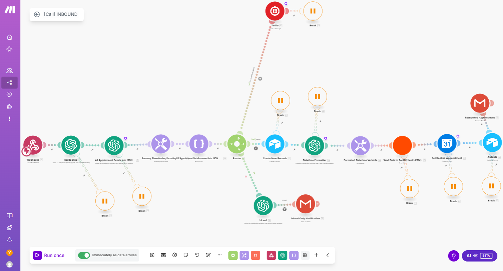

# AI-Voice-Inbound-Call-for-a-Roofing-Company

# 🤖 AI Receptionist for Luxe Roofing – Intelligent Inbound Call Assistant

This project introduces a fully automated **AI Receptionist system** designed for **Luxe Roofing**, a local roofing company based in Texas. Luxe Roofing offers free roofing inspections and handles a wide range of roofing types and home improvement services. This AI solution helps streamline their customer interaction process and improves availability and responsiveness, even outside regular business hours.

## 🏢 About Luxe Roofing

**Luxe Roofing** specializes in a variety of residential and commercial roofing services including:

- **Roof Types**: Shingles, Metal, Tile, TPO, and Flat Roofs  
- **Additional Services**: Windows, Painting, Fencing, Staining, and Siding  
- **Location**: Based in Texas  
- **Offer**: Free roofing inspections

With a goal to expand their business and provide consistent communication to potential clients, they have implemented an **AI-powered inbound call assistant** to handle customer calls efficiently and professionally.

## 📞 AI Receptionist Features

The AI Receptionist functions as a **virtual inbound call center**, with capabilities including:

- 📅 **Appointment Booking**  
  Customers can call in and book a free inspection appointment directly through the AI Assistant, which interacts with them in real-time.

- 👥 **Call Transfer to Human Representative**  
  If a caller requests to speak with a live agent, the AI attempts to transfer the call—**only during business hours**.

- 🌙 **24/7 Availability**  
  Even outside of business hours, the AI Voice Assistant can respond to inquiries, gather necessary information, and assure follow-up—ensuring no opportunity is missed.

- 💬 **Natural AI Dialogue**  
  The AI voice delivers natural, human-like interactions, offering a smooth customer experience.

## 🧠 Tech Stack

The system was developed using a combination of no-code/low-code and AI tools:

- **Vapi Voice** – AI voice assistant for real-time, intelligent phone conversations.
- **Make.com** – Automates workflows, appointment logic, and call transfers.
- **Airtable** – Stores call logs, appointment data, and customer interaction history.
- **Gmail** – Sends email notifications and confirmations.
- **Zapier** – Handles fallback automation, such as CRM updates and lead routing.

## 🌟 Business Value Delivered

- 📈 Expanded customer support hours without hiring additional staff
- 📞 Increased call handling capacity and faster response times
- 💡 Boosted customer satisfaction with 24/7 intelligent phone service
- 🔁 Seamless transition between AI and human support

---

🎯 **This project demonstrates how AI and automation can be integrated into traditional businesses to improve customer engagement and scale operations.**

💬 Want to build something similar for your business or client? Let’s connect!
